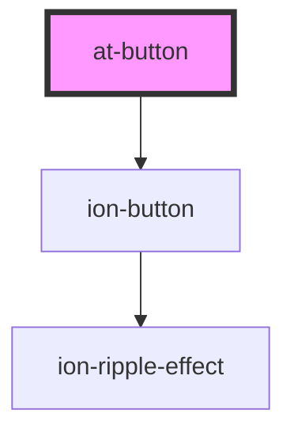

# at-button

<!-- Auto Generated Below -->

## Properties

| Property   | Attribute  | Description | Type                              | Default     |
| ---------- | ---------- | ----------- | --------------------------------- | ----------- |
| `color`    | `color`    |             | `string`                          | `undefined` |
| `disabled` | `disabled` |             | `boolean`                         | `undefined` |
| `fill`     | `fill`     |             | `"clear" \| "outline" \| "solid"` | `'solid'`   |
| `size`     | `size`     |             | `"default" \| "large" \| "small"` | `'default'` |
| `type`     | `type`     |             | `"button" \| "reset" \| "submit"` | `'button'`  |

## Events

| Event         | Description | Type               |
| ------------- | ----------- | ------------------ |
| `buttonClick` |             | `CustomEvent<any>` |

## Dependencies

### Depends on

- ion-button

### Graph

----------------------------------------------

*Built with [StencilJS](https://stenciljs.com/)*
