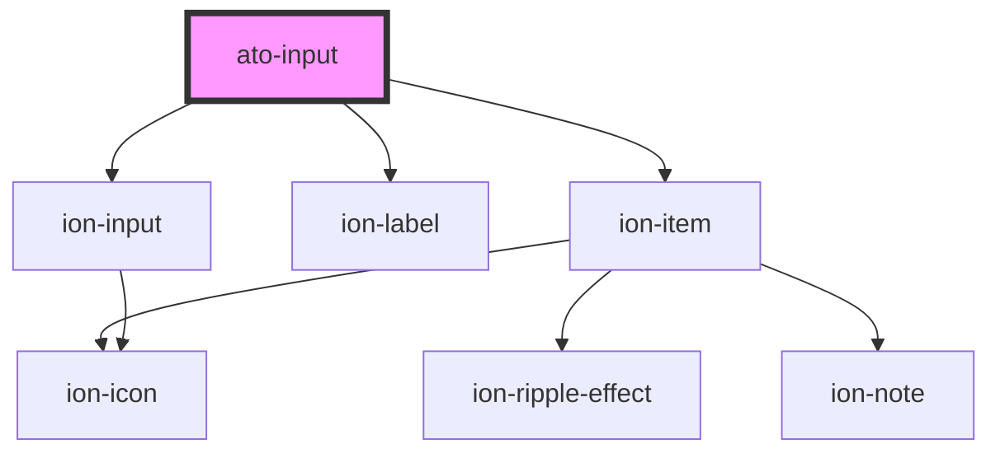

# at-input

<!-- Auto Generated Below -->

## Properties

| Property         | Attribute        | Description | Type                                                                                                                                             | Default      |
| ---------------- | ---------------- | ----------- | ------------------------------------------------------------------------------------------------------------------------------------------------ | ------------ |
| `accept`         | `accept`         |             | `string`                                                                                                                                         | `undefined`  |
| `autocapitalize` | `autocapitalize` |             | `"characters" \| "none" \| "sentences" \| "words"`                                                                                               | `undefined`  |
| `autocomplete`   | `autocomplete`   |             | `"off" \| "on"`                                                                                                                                  | `undefined`  |
| `autofocus`      | `autofocus`      |             | `boolean`                                                                                                                                        | `undefined`  |
| `clearIcon`      | `clear-icon`     |             | `string`                                                                                                                                         | `undefined`  |
| `clearInput`     | `clear-input`    |             | `boolean`                                                                                                                                        | `undefined`  |
| `clearOnEdit`    | `clear-on-edit`  |             | `boolean`                                                                                                                                        | `undefined`  |
| `color`          | `color`          |             | `"danger" \| "dark" \| "light" \| "medium" \| "primary" \| "secondary" \| "success" \| "tertiary" \| "warning" \| string & Record<never, never>` | `'primary'`  |
| `debounce`       | `debounce`       |             | `number`                                                                                                                                         | `undefined`  |
| `disabled`       | `disabled`       |             | `boolean`                                                                                                                                        | `undefined`  |
| `expandable`     | `expandable`     |             | `boolean`                                                                                                                                        | `undefined`  |
| `fill`           | `fill`           |             | `"default" \| "outline" \| "solid"`                                                                                                              | `'default'`  |
| `icon`           | `icon`           |             | `string`                                                                                                                                         | `undefined`  |
| `iconRight`      | `icon-right`     |             | `string`                                                                                                                                         | `undefined`  |
| `inputmode`      | `inputmode`      |             | `"decimal" \| "email" \| "none" \| "numeric" \| "search" \| "tel" \| "text" \| "url"`                                                            | `undefined`  |
| `labelPosition`  | `label-position` |             | `"fixed" \| "floating" \| "stacked"`                                                                                                             | `'floating'` |
| `labelText`      | `label-text`     |             | `string`                                                                                                                                         | `undefined`  |
| `maxlength`      | `maxlength`      |             | `number`                                                                                                                                         | `undefined`  |
| `minlength`      | `minlength`      |             | `number`                                                                                                                                         | `undefined`  |
| `mode`           | `mode`           |             | `"ios" \| "md"`                                                                                                                                  | `'md'`       |
| `multiple`       | `multiple`       |             | `boolean`                                                                                                                                        | `undefined`  |
| `name`           | `name`           |             | `string`                                                                                                                                         | `undefined`  |
| `pattern`        | `pattern`        |             | `string`                                                                                                                                         | `undefined`  |
| `placeholder`    | `placeholder`    |             | `string`                                                                                                                                         | `undefined`  |
| `readonly`       | `readonly`       |             | `boolean`                                                                                                                                        | `undefined`  |
| `required`       | `required`       |             | `boolean`                                                                                                                                        | `undefined`  |
| `size`           | `size`           |             | `"default" \| "large" \| "small"`                                                                                                                | `'default'`  |
| `spellcheck`     | `spellcheck`     |             | `boolean`                                                                                                                                        | `undefined`  |
| `type`           | `type`           |             | `"date" \| "datetime-local" \| "email" \| "month" \| "number" \| "password" \| "search" \| "tel" \| "text" \| "time" \| "url" \| "week"`         | `'text'`     |
| `value`          | `value`          |             | `string`                                                                                                                                         | `undefined`  |

## Events

| Event       | Description | Type                  |
| ----------- | ----------- | --------------------- |
| `atoBlur`   |             | `CustomEvent<void>`   |
| `atoChange` |             | `CustomEvent<string>` |
| `atoFocus`  |             | `CustomEvent<void>`   |

## Dependencies

### Depends on

- ion-item
- ion-label
- ion-input

### Graph

----------------------------------------------

*Built with [StencilJS](https://stenciljs.com/)*
