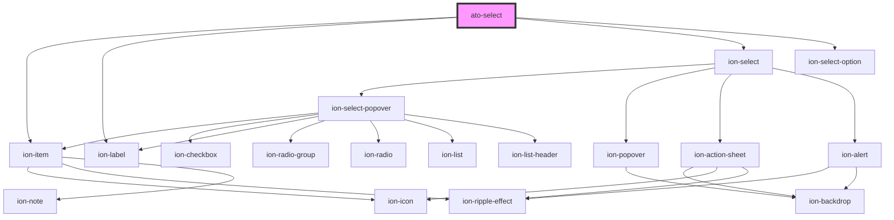

# ato-select

<!-- Auto Generated Below -->

## Properties

| Property         | Attribute         | Description | Type                                                                                                                                             | Default     |
| ---------------- | ----------------- | ----------- | ------------------------------------------------------------------------------------------------------------------------------------------------ | ----------- |
| `cancelText`     | `cancel-text`     |             | `string`                                                                                                                                         | `undefined` |
| `color`          | `color`           |             | `"danger" \| "dark" \| "light" \| "medium" \| "primary" \| "secondary" \| "success" \| "tertiary" \| "warning" \| string & Record<never, never>` | `'primary'` |
| `disabled`       | `disabled`        |             | `boolean`                                                                                                                                        | `undefined` |
| `interface`      | `interface`       |             | `"action-sheet" \| "popover"`                                                                                                                    | `'popover'` |
| `labelPosition`  | `label-position`  |             | `"fixed" \| "stacked"`                                                                                                                           | `'stacked'` |
| `labelText`      | `label-text`      |             | `string`                                                                                                                                         | `undefined` |
| `mode`           | `mode`            |             | `"ios" \| "md"`                                                                                                                                  | `'md'`      |
| `multiple`       | `multiple`        |             | `boolean`                                                                                                                                        | `undefined` |
| `name`           | `name`            |             | `string`                                                                                                                                         | `undefined` |
| `okText`         | `ok-text`         |             | `string`                                                                                                                                         | `undefined` |
| `options`        | --                |             | `{ value: string; selected?: boolean; disabled?: boolean; }[]`                                                                                   | `[]`        |
| `overlayDismiss` | `overlay-dismiss` |             | `boolean`                                                                                                                                        | `undefined` |
| `placeholder`    | `placeholder`     |             | `string`                                                                                                                                         | `undefined` |
| `size`           | `size`            |             | `"large" \| "small"`                                                                                                                             | `undefined` |

## Events

| Event       | Description | Type                  |
| ----------- | ----------- | --------------------- |
| `atoBlur`   |             | `CustomEvent<void>`   |
| `atoCancel` |             | `CustomEvent<void>`   |
| `atoChange` |             | `CustomEvent<string>` |
| `atoDimiss` |             | `CustomEvent<void>`   |
| `atoFocus`  |             | `CustomEvent<void>`   |

## Dependencies

### Depends on

- ion-item
- ion-label
- ion-select
- ion-select-option

### Graph

----------------------------------------------

*Built with [StencilJS](https://stenciljs.com/)*
